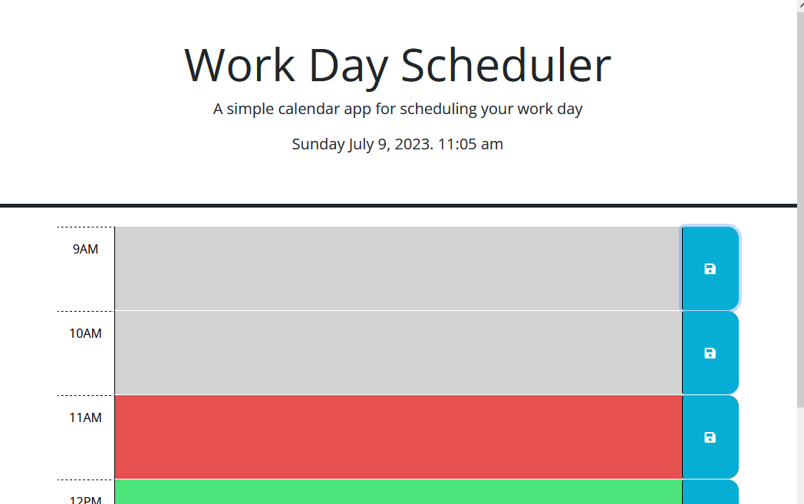

# daily-planner

The Daily Planner Site is a web application that helps you organize your daily schedule and tasks effectively. It provides a simple and intuitive interface for managing your time and ensuring you stay on track throughout the day.

## Features
* **Time Block Visualization:** The site displays time blocks for different hours of the day, allowing you to plan your activities from morning to evening.

* **Past, Present, and Future Highlighting:** The time blocks are color-coded to indicate whether they are in the past, present, or future based on the current hour. This feature helps you quickly identify and prioritize your tasks.

* **Text Saving:** Each time block has an associated text area where you can enter and save your tasks, appointments, or reminders. The site enables you to save the text to the local storage, ensuring that your schedule remains intact even if you refresh the page or close the browser.

## Usage

1. [Open the site]( https://gsr142.github.io/daily-planner/) in a web browser.

2. The time blocks will be displayed, representing different hours of the day.

3. Enter your tasks, appointments, or reminders in the respective text areas associated with each time block.

4. The time blocks will be color-coded to indicate whether they are in the past, present, or future based on the current hour.

5. To save the text in a time block, click the "Save" button or use the provided save functionality.

6. The text will be saved to the local storage, ensuring that it persists even if you refresh the page or close the browser.

7. You can revisit the site later to review or modify your schedule as needed.

## Tools Used
* [HTML](https://developer.mozilla.org/en-US/docs/Web/HTML)
* [CSS](https://developer.mozilla.org/en-US/docs/Web/CSS)
* [Bootstrap](https://getbootstrap.com/)
* [JavaScript](https://developer.mozilla.org/en-US/docs/Web/javascript)
* [jquery](https://api.jquery.com)
* [Dayjs](https://day.js.org)
* [Google Fonts](fonts.google.com)
* [Git](https://git-scm.com/)

## Code Credit
* Starter code is from the UC Berkley coding bootcamp lecture materials. 
* Page layout is sourced from Bootstrap. 

## Author
### Greg Richardson

## Contact
* gsr142@gmail.com
* [GitHub](https://github.com/gsr142)
* [LinkedIn](https://www.linkedin.com/in/gregory-richardson-7bb3a1280/)